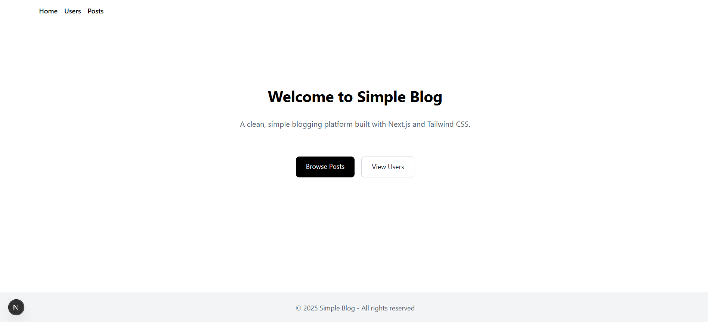
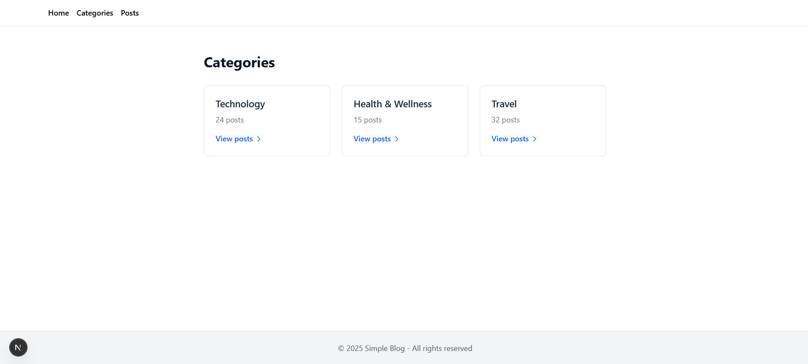
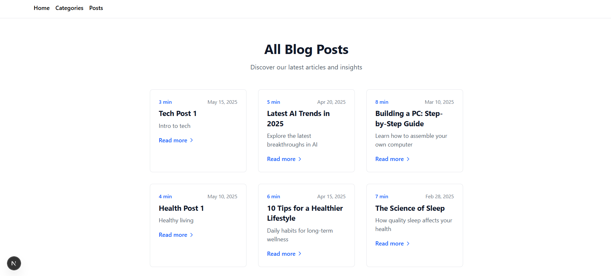
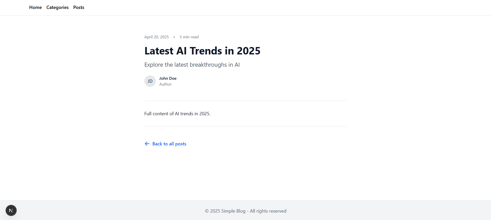
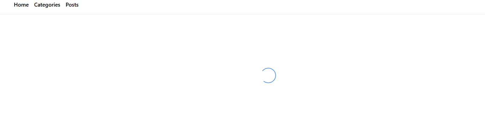

# Simple Blog - Next.js Application

## Overview

A clean, modern blog application built with Next.js and Tailwind CSS.

## Features

- 📝 Blog post listings by category  
- 🔍 Individual post pages  
- ✨ Modern UI with Tailwind CSS  
- ⚡ Fast page transitions  

## UI Examples

  
  
<em>Welcome screen with featured content</em>

  
  
<em>List of available post categories</em>

  
  
<em>All Posts</em>

  
  
<em>Post Detail</em>

  
  
<em>Loading State</em>

